# ODD23-24-WT-JavaScript


## Ex-09(a)
 # AIM
Create a form with java script code to calculate electricity bill.

# DESIGN STEPS: 9(a)

# Step 1:
Input Units Consumed: Prompt the user to enter the number of units consumed. This can be done using a Scanner object in Java.

# Step 2:
Set Rate Per Unit: Define a variable for the rate per unit of electricity. This will be a constant value that you can set according to the electricity rates in your area.

# Step 3:
Calculate Bill: Multiply the number of units consumed by the rate per unit to calculate the total bill.

# Step 4:
Display Bill: Print the calculated bill to the console.

# CODE (9a):
``````
<html>
<head>
<script type="text/javascript">
function calc()
{
var prev,curr,units,amt;
prev=Number(document.getElementById("t1").value);
curr=Number(document.getElementById("t2").value);
units=curr-prev;
if(units<=100)
	amt=100;
else if(units>100&&units<=300)
	amt=100+(units-100)*3;
else
	amt=100+600+(units-300)*5;
document.getElementById("t3").value=amt;
}
</script>
</head>
<body>
<h2>Electricity Bill</h2>
<form>
Enter Previous Reading 
<input type="text" id="t1">Enter Current Reading
<input type="text" id="t2">
<input type="button"  onclick="calc()" value="Generate Bill">
<input type="text" id="t3">
</form>
</body>
</html>
``````
# OUTPUT (9a):
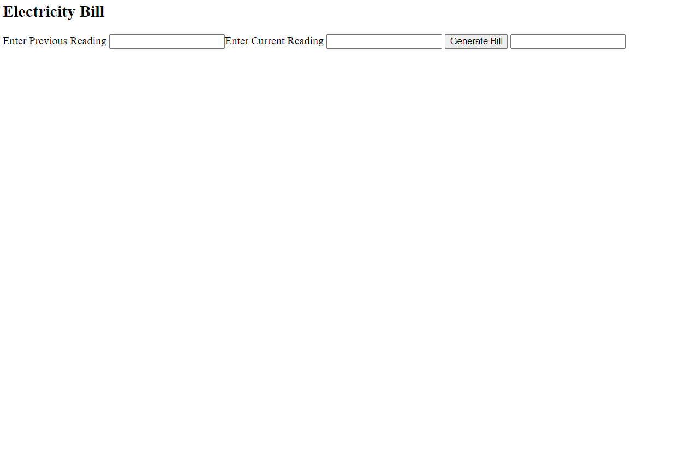


# Ex-09(b) :

# AIM
Develop a JavaScript program to compute the factorial of a given number without recursion.

# DESIGN STEPS: 9(b)

# Step 1:
Initialize a variable result to 1. This will hold the final factorial value.

# Step 2:
Start a loop from 2 to the given number n.

# Step 3:
In each iteration of the loop, multiply the current number i with result and update result.

# Step 4:
After the loop ends, result will hold the factorial of n. Return result.

# CODE(9b) :
``````
<html>
<head>
<script type="text/javascript">
function show()
{
var i, n, fact;
fact=1;
n=Number(document.getElementById("num").value);
for(i=1; i<=n; i++)  
{
fact= fact*i;
}  
document.getElementById("answer").value= fact;
}
</script>
</head>
<body>
<form>
Enter Factorial Number:
<br>
Enter Number: <input type="text" id="num">
<button onclick="show()">Factorial</button>
<input type="text" id="answer">
</form>
</body>
</html>
``````
# OUTPUT (9b):
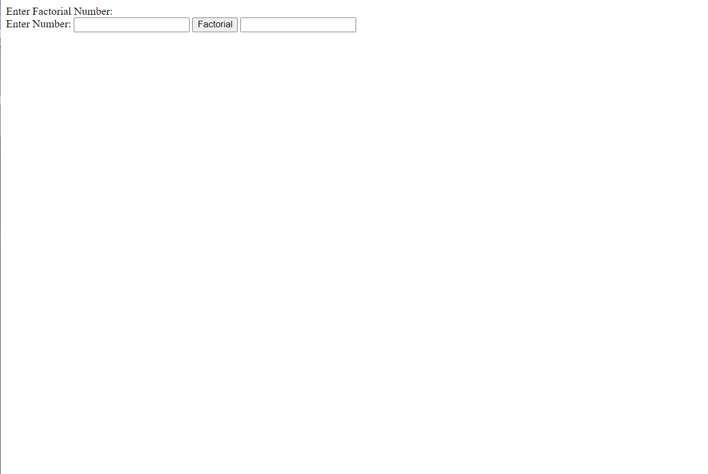

# Ex-09(c)
# AIM
Construct a JavaScript code to generate ‘N’ prime numbers.

# DESIGN STEPS: 9(c)
# Step 1:
Initialize a count variable to keep track of the number of prime numbers generated.

# Step 2:
Start from the number 2 (the first prime number), and for each number, check if it is prime.

# Step 3:
If the number is prime, increment the count and print the number.

# Step 4:
Repeat steps 2 and 3 until ‘N’ prime numbers have been generated.

# CODE(9c):
``````
<html>
<head>
<script type="text/javascript">
function show()
{
var low=Number(document.getElementById("n1").value);
var high=Number(document.getElementById("n2").value);
var i,j;
for(i=low;i<=high;i++) 
{
var flag=0;
for(j=2;j<i;j++) 
{
if(i%j==0) 
{
flag=1;
break;
}
}
if(flag==0&&i>1) 
alert(i);
}
}
</script>
</head>
<body>
<form>
Generate 'N' prime Number<br>
<input type="text" id="n1">
<input type="text" id="n2">
<input type="button" onclick="show()" value="Generate"><br>
2 3 5 7 11 13 17 19 23 29
</form>
</body>
</html>
``````
# OUTPUT(9c):
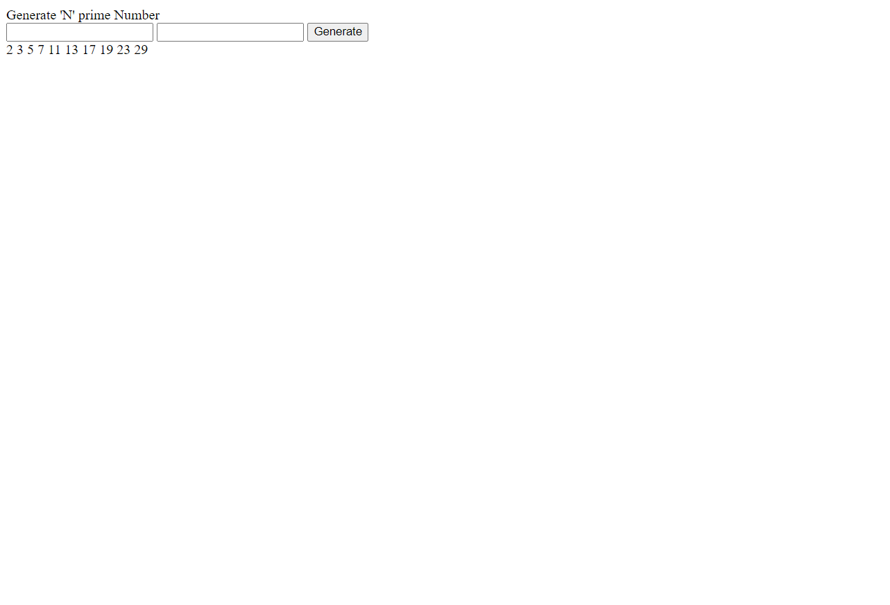

# Ex-09(d)

# AIM
Construct a JavaScript program to implement a simple calculator.

# DESIGN STEPS: 9(d)
# Step 1:
Define a function for each operation (addition, subtraction, multiplication, division) that takes two numbers as input and returns the result of the operation.

# Step 2:
Define a function calculate that takes three parameters: two numbers and an operator.operation function based on the operator provided.

# Step 3:
Call the calculate function with the numbers and operator as arguments to perform a calculation.

# Step 4:
Print the result of the calculation.

# CODE(9d)::
``````
<!DOCTYPE html>
<html>
<body>

<h2>Simple Calculator</h2>

<input id="num1" type="number" placeholder="Number 1">
<input id="num2" type="number" placeholder="Number 2">

<button onclick="add()">Add</button>
<button onclick="subtract()">Subtract</button>
<button onclick="multiply()">Multiply</button>
<button onclick="divide()">Divide</button>

<p id="result"></p>

<script>
function add() {
    var num1 = document.getElementById("num1").value;
    var num2 = document.getElementById("num2").value;
    var result = Number(num1) + Number(num2);
    document.getElementById("result").innerHTML = "Addition Result: " + result;
}

function subtract() {
    var num1 = document.getElementById("num1").value;
    var num2 = document.getElementById("num2").value;
    var result = num1 - num2;
    document.getElementById("result").innerHTML = "Subtraction Result: " + result;
}

function multiply() {
    var num1 = document.getElementById("num1").value;
    var num2 = document.getElementById("num2").value;
    var result = num1 * num2;
    document.getElementById("result").innerHTML = "Multiplication Result: " + result;
}

function divide() {
    var num1 = document.getElementById("num1").value;
    var num2 = document.getElementById("num2").value;
    if (num2 != 0) {
        var result = num1 / num2;
        document.getElementById("result").innerHTML = "Division Result: " + result;
    } else {
        document.getElementById("result").innerHTML = "Cannot divide by zero";
    }
}
</script>

</body>
</html>
``````
# OUTPUT(9d):
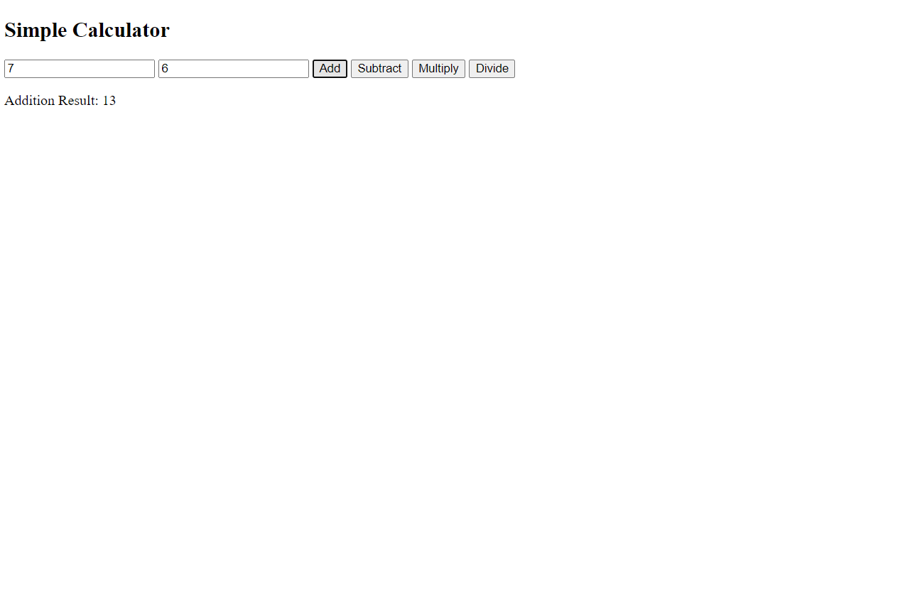
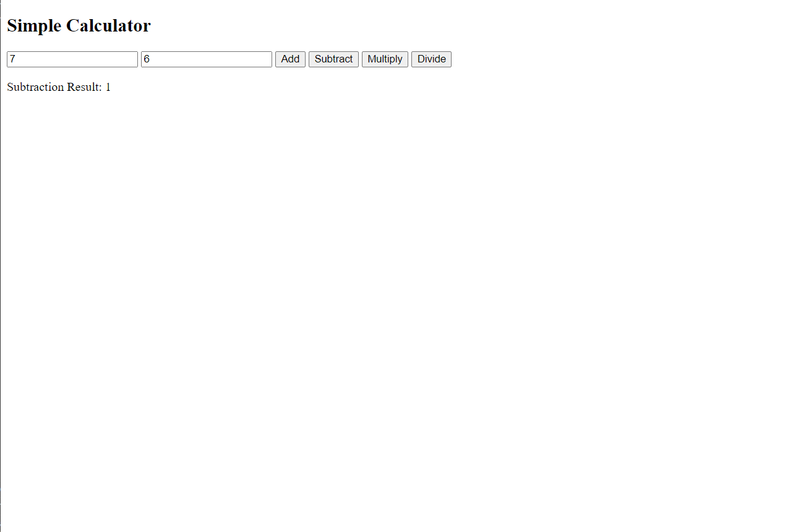
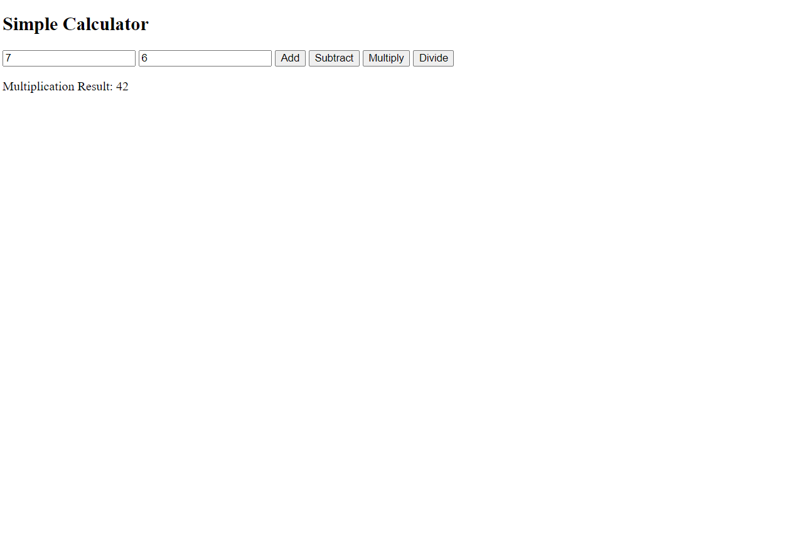
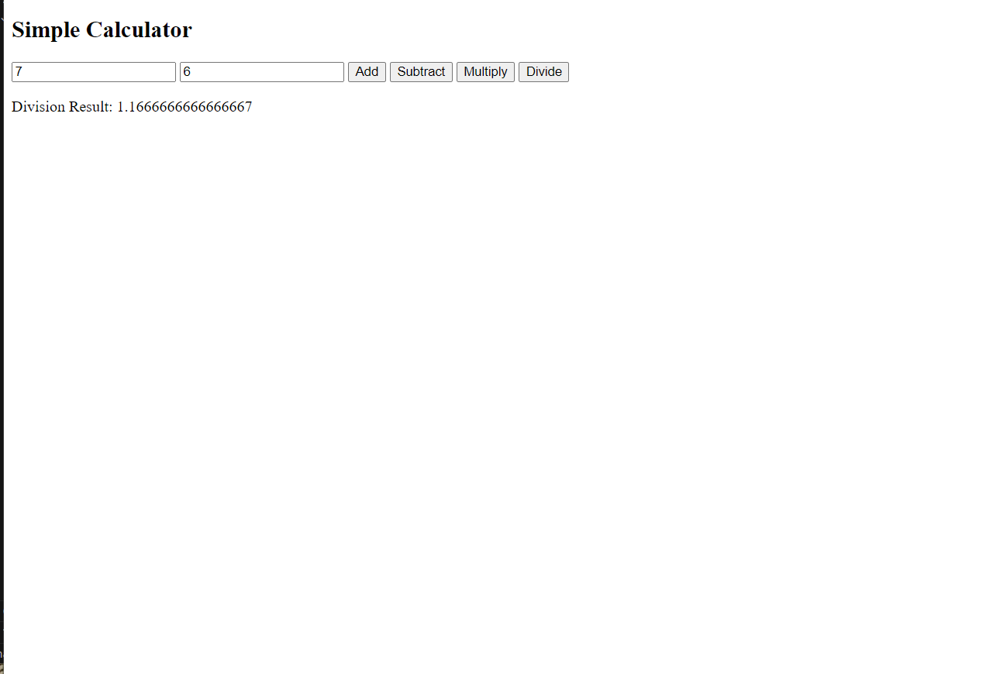


# Ex-09(e):

# AIM
Design a simple text editor JavaScript application where we can manipulate the user input in different styles, edit the input, capitalize, and many string operations.

# DESIGN STEPS: 9(e)
# Step 1:
User enters the text in the text area.

# Step 2:
User clicks on one of the buttons to perform an operation (capitalize, lowercase, reverse).

# Step 3:
The JavaScript function corresponding to the operation is executed. This function gets the text from the text area, performs the operation, and updates the result paragraph with the new text.

# Step 4:
The result is displayed on the webpage. The user can perform more operations or enter new text. The process repeats from Step 2.

# CODE(9e):
``````
<html>
<head>
<script type="text/javascript">
function f1()
{
document.getElementById("num").style.fontWeight="bold";
}
function f2()
{
document.getElementById("num").style.fontStyle="italic";
}
function f3()
{
document.getElementById("num").style.textTransform="uppercase";
}
function f4()
{
document.getElementById("num").style.textTransform="lowercase";
}
function f5()
{
document.getElementById("num").style.textTransform="capitalize";
}
function f6()
{
document.getElementById("num").style.textAlign="right";
}
function f7()
{
document.getElementById("num").style.textAlign="left";
}
function f8()
{
document.getElementById("num").style.textAlign="center";
}
function f9()
{
document.getElementById("num").style.fontWeight = "normal";
document.getElementById("num").style.textAlign = "left";
document.getElementById("num").style.fontStyle = "normal";
}
</script>
</head>
<body>
<form>
<input type="button" onclick="f1()"  value="Bold">
<input type="button" onclick="f2()"  value="Italics">
<input type="button" onclick="f3()"  value="All Caps">
<input type="button" onclick="f4()"  value="Small Caps">
<input type="button" onclick="f5()"  value="Title Case">
<input type="button" onclick="f6()"  value="Align Right">
<input type="button" onclick="f7()"  value="Align Left">
<input type="button" onclick="f8()"  value="Align Center">
<input type="button" onclick="f9()"  value="Clear Formatting">
<textarea rows="10" cols="35" id="num">
<Simple Text Editor using JavaScript></Simple>
</textarea>
</form>
</body>
</html>
``````


# OUTPUT(9e):

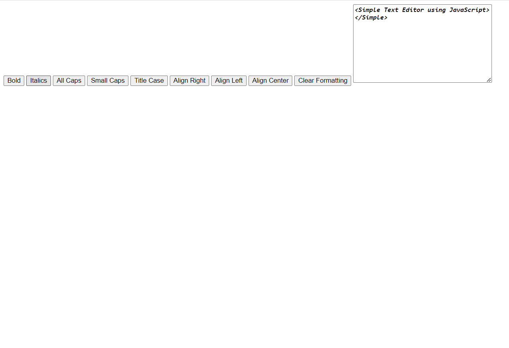

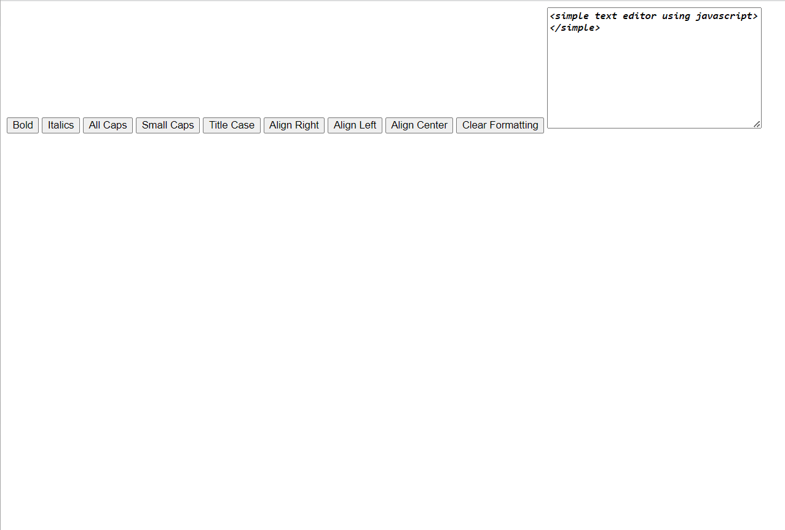
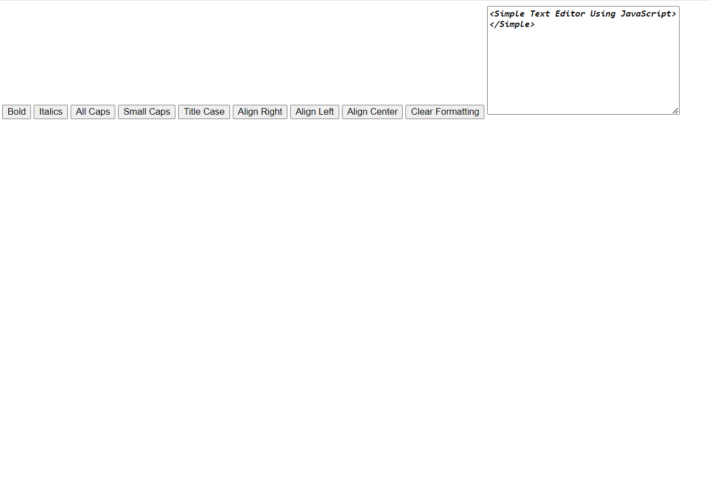


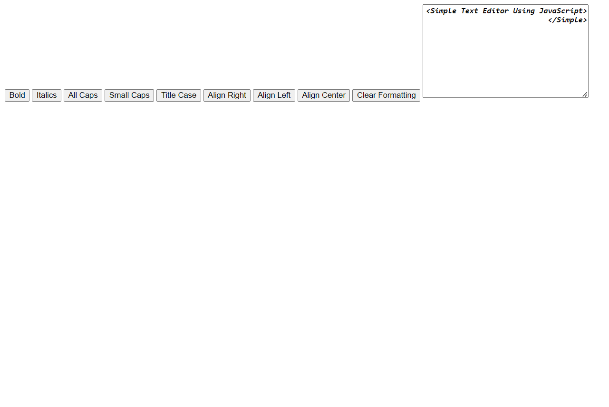

# Ex-09(f):
# AIM
Design a JavaScript program which displays error messages when a field in form is entered incorrectly.

# DESIGN STEPS: 9(f)
# Step 1:
User fills out the form and clicks the “Submit” button.

# Step 2:
The validateForm function is executed. This function gets the values of the name and email fields.

# Step 3:
The function checks if the name and email fields are filled out and if the email is a valid email address. If a field is entered incorrectly, it sets the corresponding error message.

# Step 4:
The function updates the corresponding error message spans with the error messages. If a field is entered incorrectly, the error message is displayed on the webpage. The user can correct the errors and submit the form again. The process repeats from Step 2.

# CODE(9f):
``````
<!DOCTYPE html>
<html>
<body>

<h2>Form Validation</h2>

<form id="myForm">
  <label for="name">Name:</label><br>
  <input type="text" id="name" name="name"><br>
  <span id="nameError" style="color:red"></span><br>
  <label for="email">Email:</label><br>
  <input type="text" id="email" name="email"><br>
  <span id="emailError" style="color:red"></span><br>
  <input type="button" value="Submit" onclick="validateForm()">
</form>

<script>
function validateForm() {
    var name = document.getElementById("name").value;
    var email = document.getElementById("email").value;
    var nameError = "";
    var emailError = "";

    if (name == "") {
        nameError = "Name must be filled out";
    }

    if (email == "") {
        emailError = "Email must be filled out";
    } else if (!email.includes("@")) {
        emailError = "Email must be a valid email address";
    }

    document.getElementById("nameError").innerHTML = nameError;
    document.getElementById("emailError").innerHTML = emailError;
}
</script>

</body>
</html>

``````
# OUTPUT(9f):

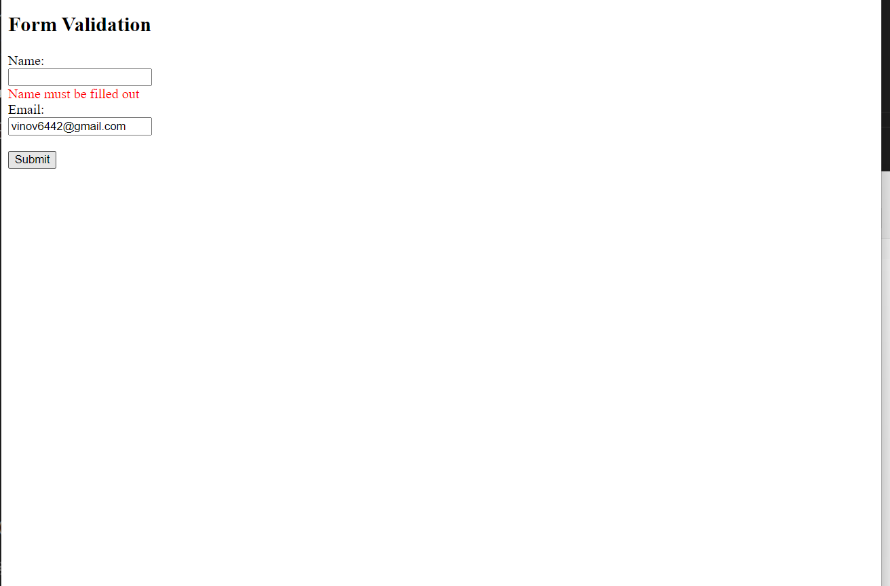
